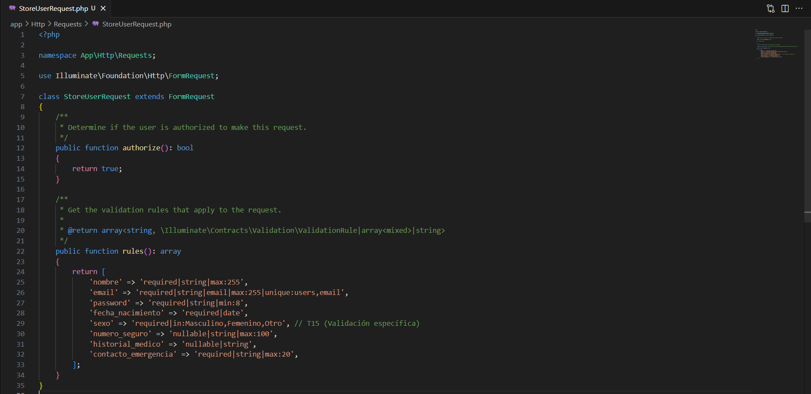
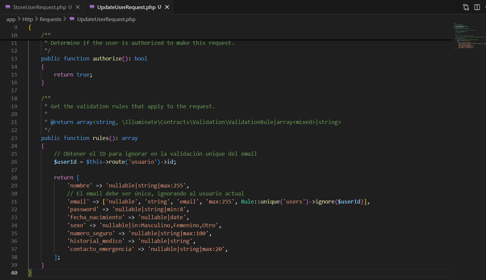

### Arquitectura de software - Grupo 5

## Integrantes

- **RODRIGUEZ BETTY**
- **DOMINGUEZ OSCAR**
- **VILLAMARIN VICTOR**
- **GUAMIALAMA NICOLAS**
- **POAQUIZA MARCO**
- **TENEMAZA ALANIS**

# 🏥 Microservicio de Gestión de Usuarios (Citas Médicas)

Este proyecto es un microservicio desarrollado en **Laravel** que implementa una **API RESTful** para gestionar usuarios (pacientes) dentro de un sistema de Citas Médicas. Utiliza el patrón **MVC** y **Laravel Sanctum** para la autenticación basada en tokens.

## 🗺️ Flujo de Trabajo

El desarrollo se organiza en fases asignadas a estudiantes:

1.  **Nicolás:** Configuración inicial del proyecto y la DB.
2.  **Betty:** Estructura de la Base de Datos y Seguridad (Sanctum).
3.  **Víctor:** Definición de Rutas API (Endpoints).
4.  **Valeria:** Lógica del Controlador (Implementación del CRUD).
5.  **Adrián:** Lógica de Validación (Form Requests).
6.  **Marco:** Autenticación (Login/Tokens) y Pruebas Finales.

---

## 🚀 1. Inicialización del Proyecto (Nicolás)

Estos comandos crean la base del proyecto Laravel y configuran el entorno de trabajo.

1.  **Crear el Proyecto Laravel:**
    ```bash
    composer create-project laravel/laravel microservicio-citas-medicas
    ```

2.  **Acceder al Directorio:**
    ```bash
    cd microservicio-citas-medicas
    ```

3.  **Configurar la Base de Datos:**
    Abrir y editar el archivo **`.env`** con las credenciales de su base de datos (Ejemplo):
    

---

## ⚙️ Configuración y Puesta en Marcha

Sigue estos pasos para levantar el microservicio en tu entorno local.

### 1. Clona el repositorio
```bash
git clone [USER_G5_AS](https://github.com/saoricoder/USER_G5_AS.git)> USER_G5_AS
cd USER_G5_AS
````

### 2\. Instala las dependencias de PHP

```bash
composer install
```

### 3\. Copia el archivo de configuración .env

```bash
cp .env.example .env
```

### 4\. Genera la clave de aplicación

```bash
php artisan key:generate
```

-----

## ⚙️ 2. Estructura y Dependencias (Betty)

**Nota:** Betty debe editar el archivo de migración preexistente (`database/migrations/*_create_users_table.php`) para añadir los campos específicos de Citas Médicas antes de migrar.

1.  **Ejecutar Migraciones:**

    ```bash
    php artisan migrate
    ```

2.  **Instalar Laravel Sanctum:**

    ```bash
    composer require laravel/sanctum
    php artisan vendor:publish --provider--"Laravel\Sanctum\SanctumServiceProvider"
    ```

-----

## 🛠️ 3. Creación de Componentes (Víctor, Valeria, Adrián)

Estos comandos generan los archivos principales del patrón MVC (Controladores) y de Validación (Form Requests).

1.  **Crear Controladores API (Víctor):**

    ```bash
    php artisan make:controller UserController --api
    php artisan make:controller AuthController
    ```

2.  **Crear Form Requests (Adrián):**

    ```bash
    php artisan make:request StoreUserRequest

    ```
    
    ```
    php artisan make:request UpdateUserRequest
    ```
    
    ```
    
    ```

-----

## ✅ 4. Puesta en Marcha y Pruebas (Marco)

Una vez que todos los archivos anteriores contengan el código de implementación, ejecute el servidor.

1.  **Iniciar el Servidor de Desarrollo:**

    ```bash
    php artisan serve
    ```

2.  **Endpoints Clave para Postman (Marco):**

      * **Login (Público):** `POST http://127.0.0.1:8000/api/login` (Retorna el **Bearer Token**).
      * **Crear Usuario (Protegido):** `POST http://127.0.0.1:8000/api/usuarios`
      * **Listar Usuarios (Protegido):** `GET http://127.0.0.1:8000/api/usuarios`
      * **Actualizar Usuario (Protegido):** `PUT/PATCH http://127.0.0.1:8000/api/usuarios/{id}`

    **Importante:** Todas las rutas del CRUD (`/api/usuarios`) requieren el encabezado \`Authorization: Bearer TOKEN para funcionar.

<!-- end list -->
